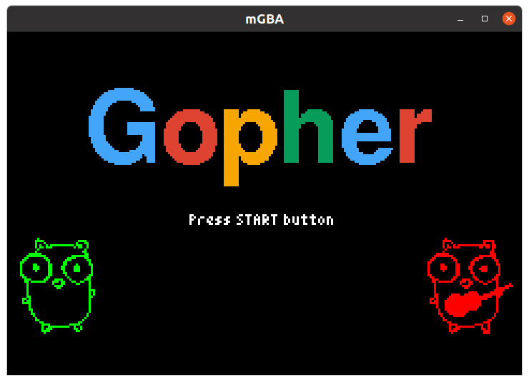
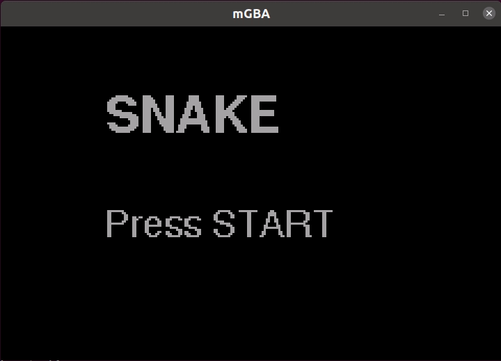

# tinygba



Tools and helpers for developing GBA programs using TinyGo.



Still highly experimental and subject to sudden changes.

## How to use

```go
package main

import (
	"machine"

	"image/color"

	"tinygo.org/x/tinygba"
)

var (
	// Colors
	black = color.RGBA{}
	white = color.RGBA{255, 255, 255, 255}
	green = color.RGBA{0, 255, 0, 255}
	red   = color.RGBA{255, 0, 0, 255}

	// Google colors
	gBlue   = color.RGBA{66, 163, 244, 255}
	gRed    = color.RGBA{219, 68, 55, 255}
	gYellow = color.RGBA{244, 160, 0, 255}
	gGreen  = color.RGBA{15, 157, 88, 255}
)

func main() {
	machine.Display.Configure()

	tinygba.FillScreen(black)

	for {
		tinygba.WaitForVBlank()

		update()
	}
}

func update() {
	key := tinygba.ReadButtons()

	switch {
	case tinygba.ButtonStart.IsPushed(key):
		tinygba.FillScreen(black)

	case tinygba.ButtonSelect.IsPushed(key):
		tinygba.FillScreen(white)

	case tinygba.ButtonRight.IsPushed(key):
		tinygba.FillScreen(green)

	case tinygba.ButtonLeft.IsPushed(key):
		tinygba.FillScreen(red)

	case tinygba.ButtonDown.IsPushed(key):
		tinygba.FillScreen(gBlue)

	case tinygba.ButtonUp.IsPushed(key):
		tinygba.FillScreen(gRed)

	case tinygba.ButtonA.IsPushed(key):
		tinygba.FillScreen(gYellow)

	case tinygba.ButtonB.IsPushed(key):
		tinygba.FillScreen(gGreen)

	}
}
```

## Roadmap

- pallettes
- sprites
- ?
